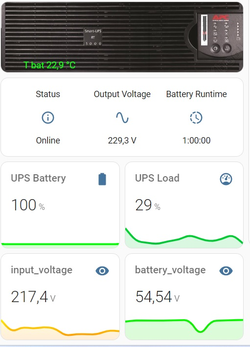
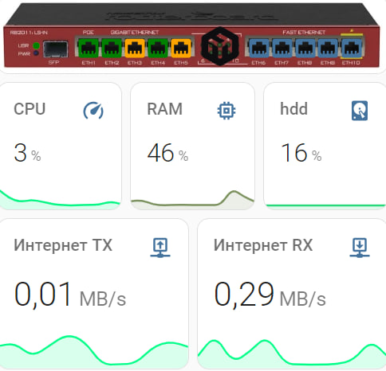
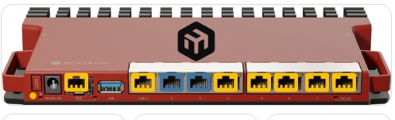
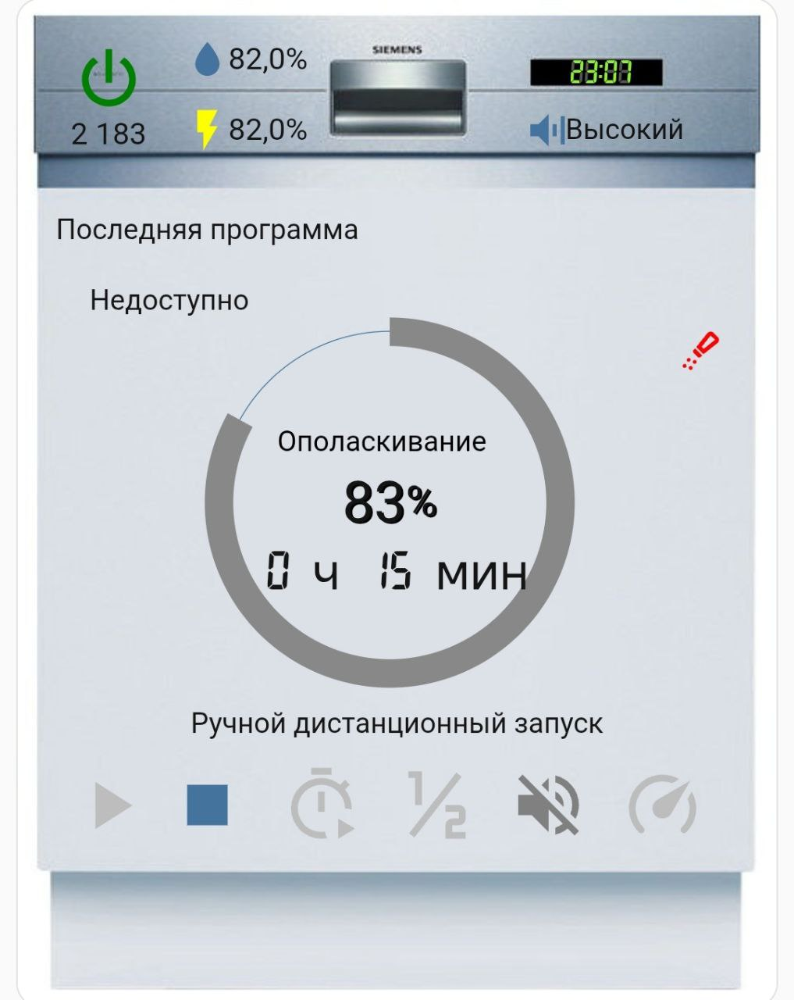

# NAS synology home assistant

# APC home assistant

# Mikrotik home assistant

# SSCPOE/STEAMEMO switch GPS208  home assistant

# Boiler Baxi home assistant

# Siemens dishwasher home assistant

https://github.com/dingausmwald/circle-sensor-card
