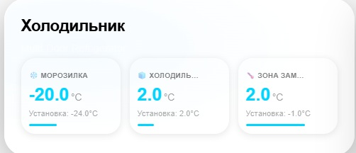
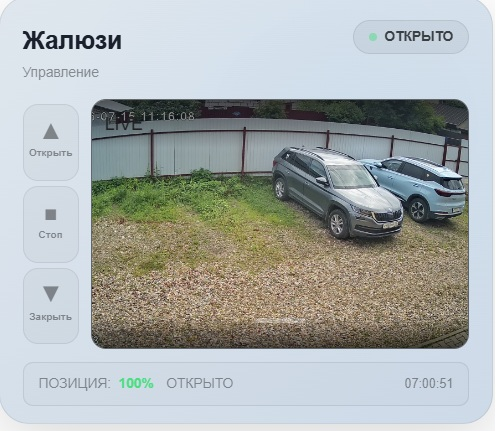
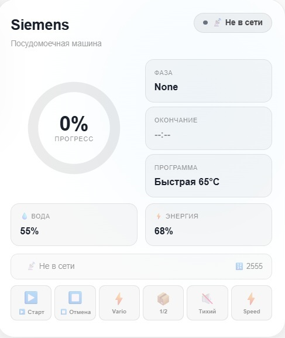

### Холодильник (Fridge)


Карточка с датчиками температуры и влажности для холодильника. Отображает текущие показания, статус работы и историю изменений.

---

### Жалюзи с камерой (Shutter-cam)


Основной вид карточки: управление жалюзи с интеграцией видеопотока. Визуальный эффект шторки показывает текущую позицию, выбор цвета жалюзи, выбор положения кнопк. Шторку можно "перетаскивать"

---

### Посудомоечная машина (Dishwasher)


Статус посудомоечной машины: отображение оставшегося времени, текущего цикла, индикатор завершения работы.

---

### Сетевой коммутатор (Network switch)


Мониторинг сетевого оборудования: отображение статуса портов, скорости соединения, нагрузки и температуры устройства.

## 🚀 Установка
Вручную
Скопируйте ha-shutter-card.zip в папку www/ha-shutter-card

Добавьте в панели/ресурсы:

``` yaml

lovelace:
  resources:
    - url: /local/ha-shutter-card/ha-shutter-card.js
      type: module

```

## 📚 Языки
Поддерживаются: 
- русский (ru),
- английский (en),
- немецкий (de),
- французский (fr),
- голландский (nl),
- польский (pl),
- шведский (sv),
- венгерский (hu),
- чешский (cs),
- итальянский (it),
- португальский (pt),
- словенский (sl).
